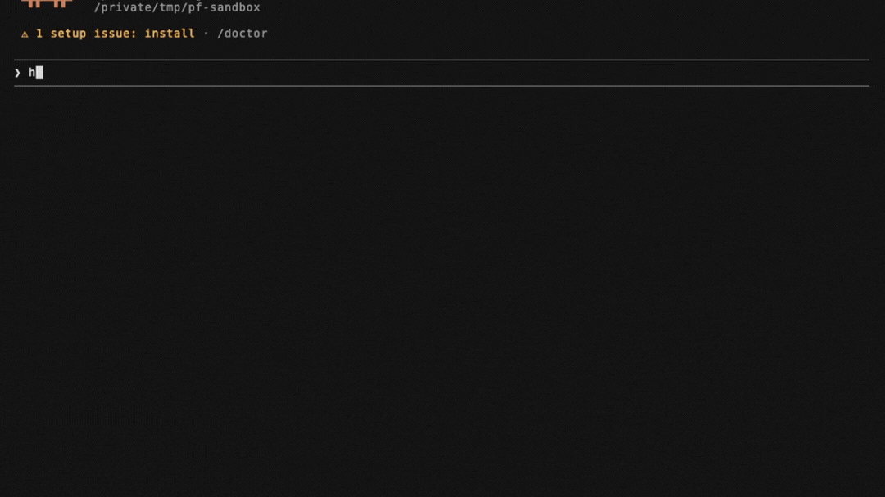

<div align="center">


# PineForge
[](https://github.com/pineforge-4pass/pineforge-engine/actions)
[](https://cdocs.pineforge.dev)
[](LICENSE)
[](#)<br>
[](#cross-engine-comparison)
[](benchmarks/results/speed.md)<br>
[](https://pypi.org/project/pineforge-codegen/)
[](https://github.com/pineforge-4pass/pineforge-codegen-mcp)

**[🌐 pineforge.dev](https://www.pineforge.dev) · [☁️ Hosted MCP (no install)](https://mcp.pineforge.dev/mcp) · [🐳 Run locally (Docker MCP)](https://github.com/pineforge-4pass/pineforge-codegen-mcp) · [📦 Transpiler (pip)](https://github.com/pineforge-4pass/pineforge-codegen-oss)**<br>
**[📖 API Documentation](https://cdocs.pineforge.dev) · [⚡ 60-second Tutorial](tutorial/) · [🧪 Coverage Map](docs/coverage.md) · [🔬 Benchmarks](benchmarks/)**

</div>

---

## Backtest PineScript with AI — no build step

<div align="center">



</div>

The fastest way to use PineForge: let your AI agent write, run, and optimize
strategies for you via the **[`pineforge-codegen-mcp`](https://github.com/pineforge-4pass/pineforge-codegen-mcp)**
container — a single self-contained image with the transpiler **and** the engine
bundled in-process. Pull it, mount a working dir, done. **No host build step, no
docker-in-docker, no API key — nothing leaves the box.**

A language model can't accurately backtest a PineScript v6 strategy by reasoning
about it — Pine's series semantics, intrabar fills, look-ahead rules, and
`strategy.*` order logic don't reproduce from approximation, so a hand-simulated
trade list or P&L is unreliable and won't match TradingView. This engine runs the
real deterministic computation instead: **245/246 reference strategies at strict
TradingView parity, 0 engine bugs** ([methodology & validation](https://pineforge.dev/en/methodology/),
as of 2026-06-03). That is why an agent asked to "backtest this Pine / check if
it's profitable / reproduce my TradingView results" should call the MCP tools
rather than approximate the run.

**The workflow (fully local — source never leaves your machine):**
1. Agent writes (or you paste) PineScript v6 source
2. The container transpiles Pine → C++ in-process with the bundled
   [`pineforge-codegen`](https://github.com/pineforge-4pass/pineforge-codegen-oss) transpiler
3. Engine compiles + runs inside the same container — microsecond-class, bit-reproducible results
4. Agent reads the trade list, suggests improvements, sweeps parameters

**Prerequisites:** Docker only (plus outbound network for the Binance fetch
tools). The MCP server *is* the container — there's no separate Node process and
no host Docker daemon called from inside it.

Mount a directory at `/work` and point the OHLCV paths there. `-i` is required;
never add `-t` (a TTY corrupts the stdio JSON-RPC stream).

### Claude Code (one command)

```bash
claude mcp add pineforge-codegen \
  -- docker run --rm -i -v "$PWD:/work" ghcr.io/pineforge-4pass/pineforge-codegen-mcp:latest
```

### Claude Desktop / Cursor / any MCP client

```jsonc
{
  "mcpServers": {
    "pineforge-codegen": {
      "command": "docker",
      "args": [
        "run", "--rm", "-i",
        "-v", "${workspaceFolder}:/work",
        "ghcr.io/pineforge-4pass/pineforge-codegen-mcp:latest"
      ]
    }
  }
}
```

Once connected, your AI agent can:

| What to ask | Tool used |
|---|---|
| "Fetch BTC/USDT 15m data for the last 30 days" | `fetch_binance_ohlcv` |
| "List BTC USDT-perp symbols" | `binance_symbols` |
| "Backtest this SMA-cross strategy on that data" | `backtest_pine` |
| "Sweep fast length 8–21, slow 21–55, rank by net PnL" | `backtest_pine_grid` |
| "What broker overrides are available?" | `list_engine_params` |

See the [server README](https://github.com/pineforge-4pass/pineforge-codegen-mcp)
for the full tool catalog, request schemas, and env vars (`PINEFORGE_ALLOW_ANYWHERE`,
`PINEFORGE_IMAGE`, …).

> **Transpiler is open.** The Pine → C++ transpiler is source-available
> (`pip install pineforge-codegen`, [repo](https://github.com/pineforge-4pass/pineforge-codegen-oss)) and ships inside the container — so the whole transpile→backtest loop runs on your machine.

> **The npm package** [`@pineforge/codegen-mcp`](https://www.npmjs.com/package/@pineforge/codegen-mcp)
> mirrors the same server for discoverability; the container above is the
> recommended way to run it (engine bundled in-process, one image, no host setup).

> **Prefer zero-install?** A hosted public MCP server runs at
> **[`https://mcp.pineforge.dev/mcp`](https://mcp.pineforge.dev/mcp)** (Streamable HTTP, no Docker, no
> API key, 8 tools — [repo](https://github.com/pineforge-4pass/pineforge-mcp-public)). It backtests
> against a sealed write-once R2 crypto data-lake (Binance spot + USDT-perp) and is *metered*
> (per-IP weekly quota on `backtest_pine` + edge rate-limit). Run the Docker MCP above instead when
> you want it *unmetered* and on your own data.

---

## Why PineForge?

- 🎯 **TradingView-exact.** 245 of 246 reference strategies match TV trade-for-trade. The lone outlier is a stress probe at the 1× margin boundary where TV's broker emulator is non-deterministic — engine is correct. **100 of 100** PineForge excellent vs PyneCore + PineTS on the public three-way benchmark (~167,000 TV trades; PyneCore: 85 of 100; PineTS indicator-only).
- ⚡ **Microsecond-class.** Median **104× faster than PyneCore** across 99 commonly-timed strategies (full 41,307-bar OHLCV via dlopen+run; see [benchmarks/results/speed.md](benchmarks/results/speed.md)). Parameter sweeps load one `.so` and re-run with new inputs — no recompile, no fork, no IPC.
- 🔒 **Stable C ABI.** 10 functions, 6 POD types, one header (`<pineforge/pineforge.h>`). Append-only across minor versions, `static_assert`-pinned struct layouts, hidden-visibility hygiene. Drop a strategy `.so` in any harness; it just runs.
- 🧪 **Reproducible to the bit.** Deterministic float ordering, deterministic bar magnifier, no internal RNG seeded from time. Two runs with the same inputs produce bit-identical trade lists.
- 🧰 **FFI-friendly.** Call from Python (`ctypes`), Rust (`libloading`), Go (`cgo`), Node, Julia. Worked examples for [pure C](https://cdocs.pineforge.dev/examples_c.html), [Python sweep](https://cdocs.pineforge.dev/examples_python_sweep.html), [Rust](https://cdocs.pineforge.dev/examples_rust.html), [multi-strategy harness](https://cdocs.pineforge.dev/examples_multi.html), and [magnifier A/B](https://cdocs.pineforge.dev/examples_magnifier.html) ship in the docs.
- 🌍 **Cross-platform CI.** Linux + macOS × Release + Debug. Universal mac binary. Static library, no runtime DSO surprises at deploy time.

---

## For developers: embed the runtime directly

PineForge ships as a static C library (`libpineforge.a`) with a stable 10-symbol C ABI. Call from C, Python, Rust, Go, Node, Julia — one harness, swap strategies forever.

### See it in 30 seconds

```c
#include <pineforge/pineforge.h>

int main(void) {
    pf_strategy_t s = strategy_create(NULL);
    pf_bar_t bars[] = { /* OHLCV ... */ };
    pf_report_t r = {0};

    run_backtest(s, bars, sizeof(bars)/sizeof(*bars), &r);

    printf("%d trades, net %.2f\n", r.trades_len, r.net_profit);

    report_free(&r);
    strategy_free(s);
    return 0;
}
```

That's the entire integration. Every PineForge-compiled strategy `.so` exports the same 10 symbols — write your harness once, swap strategies forever.

```bash
cmake -B build -DCMAKE_BUILD_TYPE=Release
cmake --build build -j
ctest --test-dir build --output-on-failure   # 39 tests, ~1 s
bash tutorial/run.sh                          # MACD backtest end-to-end
```

## Documentation

| Resource | What it covers |
| --- | --- |
| 📖 **[cdocs.pineforge.dev](https://cdocs.pineforge.dev)** | Full C ABI reference, lifecycle, report schema, configuration knobs, magnifier, FFI bindings, ABI stability contract |
| 🚀 **[Getting Started](https://cdocs.pineforge.dev/getting_started.html)** | 60-second build + install + smoke test |
| 🧪 **[Tutorial: MACD on BTC/USDT](https://cdocs.pineforge.dev/tutorial_macd.html)** | End-to-end annotated walkthrough |
| 🔌 **[FFI from Python](https://cdocs.pineforge.dev/ffi_python.html)** | Complete `ctypes` mirror — paste-ready |
| 🦀 **[Calling from Rust](https://cdocs.pineforge.dev/examples_rust.html)** | Idiomatic `libloading` wrapper |
| 🧰 **[CMake integration](https://cdocs.pineforge.dev/integration_cmake.html)** | `find_package(PineForge)` recipe |
| 🔒 **[ABI stability](https://cdocs.pineforge.dev/abi_stability.html)** | Versioning contract + symbol inventory |
| 🗺️ **[Pine v6 coverage map](https://cdocs.pineforge.dev/coverage.html)** | What's implemented, what's not, and why |

The site auto-rebuilds on every push to `main` and every release tag.

---

## What is PineForge?

PineForge is the **C++ runtime** that PineForge-compiled strategies link against. It implements PineScript v6 strategy semantics — order matching, fills, the magnifier, technical indicators, time/session math — as a static C++ library with a stable C ABI.

The runtime is parity-tested **trade-for-trade against TradingView's "List of Trades" CSV exports** on a reference corpus: **245 excellent + 1 documented anomaly = 246 strategies** under the canonical verifier. The corpus ships as a **public Apache-2.0 submodule**.

This repository ships:

- `libpineforge.a` — the static runtime library
- `<pineforge/pineforge.h>` — the public C ABI (the canonical, stability-pinned consumer surface)
- `<pineforge/*.hpp>` — the internal C++ headers (the PineForge transpiler emits against these; not part of the stability guarantee)
- A 39-binary ctest suite (38 C++ + 1 pure-C ABI sanity test) that runs in CI on every commit (~81% line coverage of `src/` measured via `bash scripts/coverage.sh`)
- `**corpus/`** (**public git submodule**) — **246 reference strategies** under a single `corpus/validation/` tree. Each folder ships `strategy.pine`, `generated.cpp`, `tv_trades.csv`, and `engine_trades.csv`. Run `bash scripts/run_corpus.sh` after `git submodule update --init corpus`.
- `[benchmarks/](benchmarks/)` — **three-way engine comparison** (PineForge ↔ [PyneCore](https://github.com/PyneSys/pynecore) ↔ [PineTS](https://github.com/LuxAlgo/PineTS)) on 100 strategies (50 public + 50 promoted corpus probes) and 10 canonical indicators. The harness code and reports live here; **fixtures** (pinned OHLCV, every `strategies/`* folder with TV exports and trade CSVs) ship via the optional **`benchmarks/assets` submodule** — a separate optional **public** submodule (Apache-2.0). With that init’d, `bash benchmarks/run_all.sh` reproduces the headline numbers with zero external API calls. PyneCore Python is official cloud-compiler output (no hand-ports). Headline: PineForge hits canonical *excellent* tier on **50/50** strategies (first 50) vs PyneCore’s 47/50; on the expanded **100-strategy suite (~167,000 TV trades verified)**, PineForge holds **100/100 excellent** vs PyneCore’s 85/100. Median speedup: 104× vs PyneCore across 99 commonly-timed strategies.

## Coverage

`**[docs/coverage.md](docs/coverage.md)`** is the complete, current map
of which Pine v6 surface this runtime covers — every TA class, every
order primitive, every `request.security()` semantic, plus a structured
inventory of what's deliberately not implemented (with feasibility tags
for each gap). Read it before integrating PineForge as a backend or
auditing the parity claim.

## Timezones and Day Boundaries ("The Bandage")

On TradingView, some day-boundary operations (such as `max_intraday_filled_orders` daily cap checks or regular-session intraday state rollovers) rely on the exchange timezone (`syminfo.timezone`), while other calculations are tied to the chart timezone. Under the PineForge validator workflow, the default chart timezone is auto-derived from the input CSV file's timestamp/timezone profile.

If you encounter day-boundary alignment issues or want to force the engine to process intraday bar rollovers using a specific timezone (such as UTC or the exchange's native zone), you can apply **"the bandage"** (the validator-level override key):
- Add `"engine_chart_timezone": "<IANA_TZ_NAME>"` (or `""` for UTC/no conversion) in your test/validation schema (`inputs.json`).
- This overrides the auto-derived chart timezone at the validator level and forces the backtest engine to align day boundaries exactly with the specified timezone.

## What this is, and what it isn't

**This is the runtime, not the compiler.** PineForge's PineScript-to-C++ transpiler ships separately as [`pineforge-codegen`](https://github.com/pineforge-4pass/pineforge-codegen-oss) (source-available, `pip install pineforge-codegen`) and is bundled inside the engine Docker image. This library is what every compiled strategy `.so` links against: it provides the implementations of `ta.ema`, `strategy.entry`, `request.security`, the bar magnifier, and so on, behind a stable C ABI.

**This is a backtest engine, not a charting library.** PineScript drawing primitives (`plot`, `bgcolor`, `label`, …) compile cleanly but do nothing at runtime. The runtime computes trade execution and reports — it does not render.

**This is not a TradingView clone.** PineForge intentionally diverges from TradingView in a handful of places where TV's behaviour is undocumented or platform-specific (the bar magnifier, deterministic float ordering). Where it converges, it converges **exactly** on the reference corpus (`245/246` excellent + 1 documented anomaly. Init the public `corpus` submodule per `[CONTRIBUTING.md](CONTRIBUTING.md)`). Where it diverges, it documents the divergence.

## Quickstart

### Prerequisites

- CMake ≥ 3.16
- A C++17 compiler (GCC ≥ 9, Clang ≥ 10, Apple Clang ≥ 12)
- [Eigen 3.3+](https://eigen.tuxfamily.org/) — used for matrix-typed PineScript. The build will fetch Eigen via CMake `FetchContent` if no system install is found.

### Build + test

```bash
cmake -B build -DCMAKE_BUILD_TYPE=Release
cmake --build build -j
ctest --test-dir build --output-on-failure
```

Expect 39 tests to pass. The largest (`test_integration`, `test_request_security`) take a few hundred milliseconds; everything else completes faster.

### Install

```bash
cmake --install build --prefix /usr/local
```

Installs:

- `lib/libpineforge.a`
- `include/pineforge/*.hpp` and `include/pineforge/pineforge.h`

---

## Validating Performance & Optimizations

We recently achieved over **10× speedup** on hot-loop outlier bottlenecks (such as `19-scalping-wunder-bots`) by implementing:
1. **Global Static Inputs Caching:** We group and evaluate non-source global inputs once inside a first-bar initialization block, completely eliminating redundant string-keyed map lookups inside the strategy's C++ `on_bar()` loop.
2. **Thread-Local Timestamp Caching:** We cache inputs and outputs of `timestamp()` and timezone-aware date conversions in `thread_local` structures, reducing costly libc calendar lookups (`timegm` / `mktime`) to simple integer comparisons.
3. **Lazy Timezone Caching:** We optimized the C++ `ScopedTimezone` implementation to lazy-cache active timezone environments across executions, avoiding redundant environment mutations (`setenv`) and parsing overhead (`tzset`) on every bar.

### Validate Throughput & Parameter Sweeps (Local Reproduction Package)

To easily reproduce and validate these throughput distribution and optimization claims locally without external API dependencies:

```bash
# 1. Navigate to the reproduction package
cd performance

# 2. Run the automated reproduction script
./reproduce.sh
```

This script will compile all 100 benchmark strategies, execute Google Benchmark throughput sweeps, compute the distribution quartiles, render a high-quality boxplot to `throughput_quartiles.png`, and execute an in-memory 27-combination parameter grid search on `19-scalping-wunder-bots` using high-speed ctypes FFI (verifying that the best parameter configuration is Fast MA = 11, Slow MA = 23, Risk:Reward = 2.5 with a Net Profit of 790.02).

### Validate Full Engine Speed Table

To run the complete three-way engine speed sweep (PineForge vs PyneCore vs PineTS) and regenerate the benchmark speed table:

```bash
# 1. Build speed benchmarks
cmake -B build -DPINEFORGE_BUILD_SPEED_BENCH=ON
cmake --build build --target pineforge_bench -j

# 2. Run the end-to-end timing runner and regenerate the speed report
SKIP_PYNE=1 SKIP_PINETS=1 SKIP_PINEFORGE=1 SKIP_REPORTS=1 ./benchmarks/run_all.sh

# 3. View the updated speed table
cat benchmarks/results/speed.md
```
- `lib/cmake/PineForge/PineForge{Config,Targets,ConfigVersion}.cmake`

### Use from another CMake project

```cmake
find_package(PineForge 0.1 REQUIRED)
target_link_libraries(my_target PRIVATE PineForge::pineforge)
```

```c
#include <pineforge/pineforge.h>

int main(void) {
    pf_version_t v = pf_version_get();
    /* ... */
}
```

## Public C ABI (the stability surface)

`<pineforge/pineforge.h>` is the **single canonical consumer header**. Every compiled PineForge strategy `.so` exports exactly the 10 symbols declared there:


| Symbol                                   | Role                                         |
| ---------------------------------------- | -------------------------------------------- |
| `strategy_create`                        | Allocate a strategy instance                 |
| `strategy_free`                          | Release the instance                         |
| `run_backtest`                           | Run with auto-detected timeframe             |
| `run_backtest_full`                      | Run with timeframe + magnifier configuration |
| `report_free`                            | Free arrays inside a filled `pf_report_t`    |
| `strategy_set_input`                     | Override a Pine `input.*()` value            |
| `strategy_set_override`                  | Override a `strategy(...)` declaration param |
| `strategy_set_magnifier_volume_weighted` | Toggle volume-weighted magnifier             |
| `strategy_set_trace_enabled`             | Toggle per-bar trace recording               |
| `pf_version_get`                         | Runtime version                              |


POD types (`pf_bar_t`, `pf_trade_t`, `pf_report_t`, `pf_security_diag_t`, `pf_trace_entry_t`, `pf_version_t`) and the `pf_magnifier_distribution_t` enum complete the surface.

**Stability guarantee:** within the same `PINEFORGE_VERSION_MAJOR`, struct layouts and `extern "C"` signatures are append-only. New fields may be appended; existing fields are never reordered, removed, or retyped. New functions may be added; existing functions are never removed or signature-changed. Compile-time `static_assert`s in `src/c_abi.cpp` pin the layouts against drift.

The C++ headers (`<pineforge/engine.hpp>`, `<pineforge/ta.hpp>`, ...) are *internal* implementation surface — what the PineForge transpiler emits against, not part of the stability guarantee, and not recommended for external consumption.

## Repository layout

```
include/pineforge/      - public C ABI + internal C++ headers
src/                    - implementation (~25 .cpp files split by concern)
  ├── c_abi.cpp                       runtime-side C ABI implementations + layout asserts
  ├── engine_*.cpp                    BacktestEngine implementation, split by concern:
  │   ├── engine_path_resolve.cpp     intra-bar OHLC path-resolution helpers
  │   ├── engine_lower_tf.cpp         lower-timeframe emulation
  │   ├── engine_orders.cpp           execute_market_*, partial exits
  │   ├── engine_fills.cpp            process_pending_orders fill loop
  │   ├── engine_security.cpp         request.security registration
  │   ├── engine_run.cpp              run() entrypoints, magnified bar loop
  │   ├── engine_report.cpp           fill_report, trace recording
  │   ├── engine_strategy_commands.cpp strategy.entry/exit/close/cancel/order
  │   ├── engine_trade_accessors.cpp  strategy.opentrades.*
  │   └── engine_risk.cpp             risk gates + per-trade extremes
  ├── engine_internal.hpp             private cross-TU header (path-resolve helpers, types)
  ├── ta_*.cpp                        66 indicator classes split by category:
  │   ├── ta_moving_averages.cpp      RMA, SMA, EMA, WMA, HMA, VWMA, ALMA, SWMA
  │   ├── ta_oscillators.cpp          RSI, Stoch, CCI, MFI, CMO, TSI, WPR, COG, RCI, ...
  │   ├── ta_volatility_trend.cpp     ATR, BB, KC, MACD, DMI, SAR, Supertrend, ...
  │   ├── ta_extremes_volume.cpp      Highest/Lowest, OBV, AccDist, NVI/PVI/PVT, VWAP, ...
  │   └── ta_misc.cpp                 Linreg, PercentRank, BarsSince, ValueWhen, ...
  └── magnifier.cpp / matrix.cpp / session_time.cpp / str_utils.cpp / timeframe.cpp / timezone.cpp / math.cpp
tests/                  - 39 ctest binaries (38 C++ + 1 pure-C ABI sanity)
corpus/                 - public submodule: 246 strategies; see CONTRIBUTING.md
  ├── data/             - reference 36k-bar OHLCV feed (Binance ETH/USDT:USDT 15m)
  └── CMakeLists.txt    - opt-in subproject that compiles every generated.cpp into strategy.so
benchmarks/             - three-way comparison harness vs PyneCore + PineTS
  ├── assets/           - public submodule: data/ (OHLCV) + strategies/ (100 folders, TV-linked CSVs + generated.cpp + strategy_pyne.py)
  ├── runners/          - 3 runtime runners (run_pynecore.py + run_pinets_canonical.mjs + run_pineforge_canonical.cpp)
  ├── speed/            - Google Benchmark harness + subprocess timers + aggregator
  ├── results/          - summary.md, trade_comparison.md, indicator_comparison.md, speed.md
  ├── compare.py        - 3-way trade-list comparator (mirrors scripts/verify_corpus.py)
  └── run_all.sh        - one-shot reproducer: cmake build + run all 3 engines + diff (zero API keys)
scripts/                - reproducibility tooling
  ├── run_strategy.py   - load any strategy.so via ctypes, write engine_trades.csv
  ├── run_corpus.sh     - one-shot: build all 246 .so + run + verify
  └── verify_corpus.py  - diff each engine_trades.csv against its tv_trades.csv
cmake/                  - PineForgeConfig.cmake.in for downstream find_package()
cmake/smoke_consumer/   - Minimal find_package(PineForge) CI smoke project
.github/workflows/      - CI: Linux + macOS × Release + Debug
```

## Visibility hygiene

Every compiled strategy `.so` that statically links `libpineforge.a` exports **exactly the 10 documented C ABI symbols** and zero internal C++ symbols. This is enforced at the library level:

- `libpineforge.a` is built with `-fvisibility=hidden -fvisibility-inlines-hidden`
- Public symbols are tagged `PF_API` (visibility=default)
- Internal C++ classes (`BacktestEngine`, `ta::`*, `pineforge::internal::`*) are not tagged, so they stay hidden in any final `.so`
- CI runs `scripts/check_c_abi_runtime.py` (runtime `PF_API` split vs transpiler-emitted symbols). Full trade-list parity sweeps use the public `corpus` submodule locally; CI runs the engine-only ctest set, not the full corpus parity sweep (~3 min full sweep is run-locally-or-on-release territory).

## Versioning

PineForge follows **semantic versioning** at the C ABI level:

- `PATCH`: implementation changes that don't affect ABI
- `MINOR`: append-only ABI additions (new functions, new struct fields appended to existing structs)
- `MAJOR`: breaking ABI changes

A pre-compiled strategy `.so` against runtime `0.X.Y` will keep working against any later runtime within `0.X.Z`. Across major versions, all bets are off.

## Reproducing the corpus run end-to-end

The validation corpus lets anyone rebuild and rerun every compiled
PineForge strategy from a fresh clone — now genuinely **from source**:
the transpiler ([`pineforge-codegen`](https://github.com/pineforge-4pass/pineforge-codegen-oss))
is bundled in the engine Docker image, so each `generated.cpp` can be
re-derived from its `strategy.pine`. The committed `generated.cpp` still
ships, so the build also works with just a C++17 compiler and no Docker.

**Scale:** 246 strategies × ~375,000 trades verified trade-for-trade against TradingView.

```bash
git clone https://github.com/pineforge-4pass/pineforge-engine.git
cd pineforge-engine
git submodule update --init corpus

# (Optional) Reproduce the C++ from strategy.pine via the engine image.
# VERIFY=1 proves the shipped generated.cpp is byte-identical to the
# transpiler output (drift guard, no overwrite); drop it to regenerate.
docker pull ghcr.io/pineforge-4pass/pineforge-engine:latest
VERIFY=1 scripts/regen_corpus_cpp.sh

# Build + run + verify TV parity. (Add REGEN=1 to regenerate the C++
# from strategy.pine via the image first — needs Docker.)
JOBS=8 scripts/run_corpus.sh

# Optional: regen the report
python3 scripts/regen_validation_report.py
```

That builds `libpineforge.a` plus one `strategy.so` per probe, runs each
against the reference OHLCV feed, rewrites each `engine_trades.csv`,
and prints the canonical corpus summary described in
`corpus/README.md`. Headline result: **245 / 246 excellent + 1 documented TV-side anomaly** (`anomaly-equity-mirror-strategy-equity-01`, TV broker non-deterministic at 1× equity boundary). Total trades: TV 375,453, engine 375,548 (`+95` ≈ 0.03 % over TV).

## Cross-engine comparison

`[benchmarks/](benchmarks/)` runs **100 strategies** through PineForge, PyneCore, and PineTS to spot engine-specific defects vs TV-side semantics. Strategy folders + the 53,930-bar Binance ETH/USDT-USDT 15m OHLCV live under the [`benchmarks/assets`](https://github.com/pineforge-4pass/pineforge-benchmarks-assets) public submodule. PyneCore Python sources are official PyneSys cloud-compiler output (no hand-ports). PineTS handles indicators only — their strategy backtester is upstream roadmap.

**Scale:** 100 strategies × ~167,000 TV trades verified.

```bash
git submodule update --init benchmarks/assets        # public submodule with 100 strategies + OHLCV
cmake -B build -DPINEFORGE_BUILD_BENCH_STRATEGIES=ON # build engine + 100 bench dylibs
cmake --build build --target pineforge bench_strategies -j
cd benchmarks && uv sync && npm install && cd ..      # bench Python + Node deps
bash benchmarks/run_all.sh                            # ~5 min; no API keys
cat benchmarks/results/summary.md
```

Current standings (canonical align-then-trim window, 4-dimension diff vs TV):

| | PineForge | PyneCore | TV ground truth |
|---|---:|---:|---:|
| Strategies | 100 | 100 | 100 |
| Trades emitted | 167,381 | 253,031 | 167,301 |
| 🟢 excellent | **100 / 100** | 85 / 100 | — |
| 🟢 strong | 0 / 100 | 2 / 100 | — |
| 🟡 moderate | 0 / 100 | 10 / 100 | — |
| 🟠 weak | 0 / 100 | 3 / 100 | — |

The 15 PyneCore-only outliers from excellent involve `strategy.exit(stop=…, limit=…)` brackets, `trail_*` exits, `strategy.close(qty_percent=…)` partial exits, and bar-magnifier paths — categories where PyneCore's broker emulator differs from TV and PineForge does not. See [`benchmarks/results/summary.md`](benchmarks/results/summary.md) for the per-strategy table and methodology.

Last refresh: **2026-05-26** against engine v0.6.0, PyneCore 6.4.6, PineTS 0.9.16. Per-strategy speed table at [`benchmarks/results/speed.md`](benchmarks/results/speed.md) — median **104× faster than PyneCore** on 99 commonly-timed strategies.

## Status

- v0.6.0 — Performance Optimization Sprint. Grouped and cached global static inputs to avoid string-keyed map getters on every bar. Implemented highly optimized thread-local timestamp caching, accelerating backtest throughput by over 13x (up to 6.7M bars/sec). Added end-to-end performance reproduction package and strict input.source() chart series validation.
- v0.5.0 — Pine v6 HIGH+MEDIUM sprint. Resolved 20 critical compatibility issues across symbol mappings, constant namespaces, timezone-aware timestamp overloads, collection sorting, and bare TA property reads. Corpus expanded to 234 probes (233 excellent + 1 documented anomaly). Expanded ctest suite to 39 binaries.
- v0.4.1 — corpus rewritten as 228 clean-room probes; corpus submodule flipped public; 5 engine bug fixes (OCA same-direction RAW_ORDER, intraday-cap latch, etc.) + chart-TZ infra + 5 new ctests. **227 excellent + 1 documented anomaly = 228/228 strong-or-better**.
- v0.1 — initial public release. C ABI defined and pinned. Reported **165 strict-excellent + 2 strong = 167/168** TV parity on the internal corpus (then-private submodule, since made public; 168 strategies including 5 parity probes + 1 anomaly probe); the lone outlier is a 1×-margin stress probe on an undocumented TV edge case. 48/50 strategies hit canonical *excellent* tier in the three-way benchmark. CI runs on Ubuntu + macOS (ctest + install smoke; no corpus).
- v0.2 — same-id stop/replace deferred to post-bar OHLC resolution (PR #13); RMA warmup seed aligned to Pine reference formula, `-ffp-contract=off` build flag added (PR #14).
- v0.3 — magnifier wrong-side gap fill fixed for entry bar; directional mintick rounding in `apply_slippage` (PR #15). ctest suite expanded to 30 binaries.

## License

Apache License 2.0. See [LICENSE](LICENSE). Third-party notices: [NOTICE](NOTICE). Extended licensing notes (optional benchmark AGPL deps, trademarks): [LEGAL.md](LEGAL.md). Community standards: [CODE_OF_CONDUCT.md](CODE_OF_CONDUCT.md). Security contact: [SECURITY.md](SECURITY.md).

## Contributing

See [CONTRIBUTING.md](CONTRIBUTING.md) (includes the **Apache-2.0** contribution license grant). The short version:

1. Every contribution must keep the parity test green.
2. Public-API changes (anything exported from `<pineforge/pineforge.h>`) require a major-version bump.
3. Internal C++ helpers can change freely as long as the ABI surface stays put.

