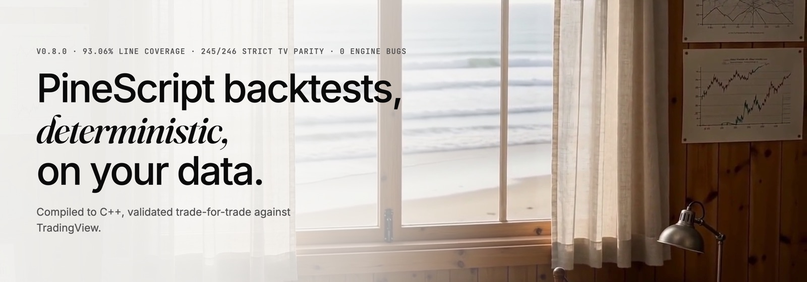

<div align="center">



# PineForge

**The open-source PineScript v6 backtest engine that reproduces TradingView trade-for-trade.**

[](https://github.com/pineforge-4pass/pineforge-engine/actions)
[](#validation-scoreboard)
[](#validation-scoreboard)
[](benchmarks/results/speed.md)<br>
[](LICENSE)
[](#)
[](https://cdocs.pineforge.dev)
[](https://pypi.org/project/pineforge-codegen/)
[](https://github.com/pineforge-4pass/pineforge-backtest-mcp)

**[🌐 pineforge.dev](https://www.pineforge.dev) · [☁️ Hosted MCP](https://mcp.pineforge.dev/mcp) · [🐳 Docker MCP](https://github.com/pineforge-4pass/pineforge-backtest-mcp) · [📦 Transpiler](https://github.com/pineforge-4pass/pineforge-codegen-oss) · [📖 C ABI docs](https://cdocs.pineforge.dev) · [🧪 Coverage map](docs/coverage.md) · [🔬 Benchmarks](benchmarks/)**

</div>

---

## Why PineForge

PineForge is a C++17 engine for backtesting and forward execution, with a C ABI for embedding. The separate PineForge compiler translates PineScript v6 into C++ strategies. Native order contracts prioritize deterministic actions, ownership and settlement; TradingView comparisons measure the Pine frontend's compatibility under the tested configurations. The [order model](docs/pages/fill-model.md) describes the current submodels and the remaining migration work.

- **Proven, not promised.** All 4,190 probes — 312 open reference strategies plus 413 real community scripts on 15 markets and timeframes — grade *excellent* or *strong* against TradingView's own trade lists: **4,182 excellent, 8 strong, zero moderate**. The current full sweep evaluates 2,819,967 TradingView trades, with 2,818,237 matched by the verifier.
- **Open runtime.** The engine and native live runner are Apache-2.0. The separately distributed [PineForge compiler](https://github.com/pineforge-4pass/pineforge-codegen-oss/blob/main/LICENSE) uses PolyForm Noncommercial terms with additional personal-trading permission; commercial use requires a separate license. Public reference strategies, benchmarks and validation tooling are available in their respective repositories; the community-script test set is not redistributed.
- **Fast.** In-process, no interpreter: median **162× faster than PyneCore** on 99 timed strategies. Parameter sweeps re-run a loaded `.so` with new inputs — no recompile, no fork.
- **Deterministic to the bit.** Two runs with the same inputs produce identical trade lists. Same on Linux and macOS.
- **Yours to embed.** One header, 32 `extern "C"` functions, append-only ABI. Call it from C, Python, Rust, Go, Node, Julia — or let an AI agent drive it over MCP.

---

## Get a backtest in 60 seconds

### With an AI agent (MCP, Docker only)

```bash
claude mcp add pineforge-backtest \
  -- docker run --rm -i -v "$PWD:/work" ghcr.io/pineforge-4pass/pineforge-backtest-mcp:latest
```

For Claude Desktop, Cursor or any MCP client:

```jsonc
{
  "mcpServers": {
    "pineforge-backtest": {
      "command": "docker",
      "args": ["run", "--rm", "-i", "-v", "${workspaceFolder}:/work",
               "ghcr.io/pineforge-4pass/pineforge-backtest-mcp:latest"]
    }
  }
}
```

Then ask: *"Fetch BTC/USDT 15m for the last 90 days and backtest this strategy"* — the container transpiles Pine → C++ with the bundled [`pineforge-codegen`](https://github.com/pineforge-4pass/pineforge-codegen-oss), compiles, runs, and hands the agent the trade list. Nothing leaves your machine. Mount a directory at `/work`; `-i` is required and `-t` must not be added (a TTY corrupts the JSON-RPC stream).

| Ask | Tool |
|---|---|
| "Fetch BTC/USDT 15m data for the last 30 days" | `fetch_binance_ohlcv` |
| "Backtest this SMA-cross strategy on that data" | `backtest_pine` |
| "Sweep fast 8–21 × slow 21–55, rank by net PnL" | `backtest_pine_grid` |
| "What broker overrides are available?" | `list_engine_params` |

Prefer zero install? The hosted server at **[mcp.pineforge.dev/mcp](https://mcp.pineforge.dev/mcp)** (Streamable HTTP, no key) backtests against a sealed Binance spot + USDT-perp data lake, metered per IP. The npm package [`@pineforge/backtest-mcp`](https://www.npmjs.com/package/@pineforge/backtest-mcp) mirrors the same server.

[](https://www.youtube.com/watch?v=lflD47Bum4w)

### From source

```bash
git clone https://github.com/pineforge-4pass/pineforge-engine.git && cd pineforge-engine
cmake -B build -DCMAKE_BUILD_TYPE=Release
cmake --build build -j
ctest --test-dir build --output-on-failure     # all enabled unit, replay and ABI checks
bash tutorial/run.sh                            # MACD on BTC/USDT, end to end
python3 tutorial/run_stream.py                  # OHLCV warm-up → realtime trades
```

Prerequisites: CMake ≥ 3.16, a C++17 compiler (GCC ≥ 9, Clang ≥ 10, Apple Clang ≥ 12), Eigen 3.3+ (fetched automatically if absent), Python 3 for the tests (`-DPINEFORGE_BUILD_TESTS=OFF` for a library-only build). `cmake --install build --prefix /usr/local` installs `lib/libpineforge.a`, `include/pineforge/`, and the `find_package(PineForge)` config.

### Embedded in your own harness

```c
#include <pineforge/pineforge.h>

int main(void) {
    pf_strategy_t s = strategy_create(NULL);
    pf_bar_t bars[] = { /* OHLCV ... */ };
    pf_report_t r = {0};

    run_backtest(s, bars, sizeof(bars)/sizeof(*bars), &r);
    printf("%d trades, net %.2f\n", r.trades_len, r.net_profit);

    report_free(&r);
    strategy_free(s);
    return 0;
}
```

Every PineForge-compiled strategy `.so` exports this same ABI — write the harness once, swap strategies forever. Worked examples for [C](https://cdocs.pineforge.dev/examples_c.html), [Python sweeps](https://cdocs.pineforge.dev/examples_python_sweep.html), [Rust](https://cdocs.pineforge.dev/examples_rust.html), [multi-strategy](https://cdocs.pineforge.dev/examples_multi.html) and [magnifier A/B](https://cdocs.pineforge.dev/examples_magnifier.html) are in the docs.

Lifecycle-aware compiled modules reset Pine variables, indicator/history buffers and the broker book before each batch run or `strategy_stream_begin` warmup. Inputs and runtime settings persist until changed; ticks within a stream continue its state. Regenerate and rebuild existing modules with current codegen and matching engine headers/archive to obtain this behavior; the [internal C++ rebuild boundary](docs/pages/abi-stability.md) is checked at compile/link time.

---

## Native C++ strategy API

Use `NativeStrategyHost` with an explicit `NativeRunSpec` for native market
transactions, reductions and flatten requests. The [native engine guide](docs/pages/native-engine.md)
provides a complete C++ batch/stream example, calendar and execution contracts,
and a runnable JSON configuration for the live runner.

## Native live runner

The optional C++17 `pineforge-live` executable uses this engine's native
warmup-to-stream lifecycle. It accepts normalized ticks or confirmed OHLCV bars,
supports user-defined C++ parsers for broker/provider messages, and commits
inputs plus order-action webhooks to a durable SQLite ledger. Hand-written
C++ strategies use the native contract; generated Pine strategies retain their
compatibility path. Both expose the versioned C ABI used by the runner.

Build with `-DPINEFORGE_BUILD_LIVE_RUNNER=ON`; the option is off by default,
so core-only users do not acquire SQLite/libcurl/OpenSSL dependencies. See
the [native runner guide](runner/README.md) for feed modes, symbol metadata,
parser ABI, recovery and execution limitations. The existing validation
scoreboard below describes batch backtests; it does not certify new native
live behavior or real broker fills.

## Validation scoreboard

**Native policy refactoring · 2026-09-10:** engine [#234](https://github.com/pineforge-4pass/pineforge-engine/pull/234) and codegen [#127](https://github.com/pineforge-4pass/pineforge-codegen-oss/pull/127) preserve **4,182 excellent / 8 strong**. Both the old-engine/new-codegen and new-engine/new-codegen Cloud runs retain all **4,190 raw trade CSVs, counts and full grades** unchanged. The target bands have zero entrants and zero leavers: **net 0, no individual regression**. These changes remove an unused source flag and give Pine cap behavior explicit ownership; they do not claim complete engine independence. The formal gates remain zero-improvement FAILs and the official baseline remains unchanged.

**Round 39 · 2026-09-09:** **4,182 excellent / 8 strong / zero moderate** across all **4,190 scored probes**. This round adds one excellent result, with zero regressions on any canonical metric.

| Board | Test set | Result | TradingView trades evaluated |
|---|---|---|---|
| **Public** — [open corpus](https://github.com/pineforge-4pass/pineforge-corpus) | 312 reference strategies, Apache-2.0, reproducible by anyone | **309/309 graded excellent** (ETH/USDT-perp 15m; the corpus' declared engine-only / anomaly probes are not graded) | 429,866 |
| **Closed test** — the parity campaign | 413 community-shared TradingView scripts across 15 market/timeframe lanes: **3,881 script-lane probes** — private under TradingView's Terms of Service | **3,873 excellent + 8 strong + zero moderate** = 3,881/3,881 (100%) excellent-or-strong | 2,390,101 |

**2,819,967 TradingView trades** evaluated, **2,818,237 matched by the verifier** (99.94%), from the round 39 full Cloud Run sweep. **18 TradingView-side anomalies** remain excluded under the unchanged population; each was documented before exclusion. No scored probe remains below *strong*.

Round 39 extends the existing price-scale admission check to ordinary, fee-free fractional market entries when one minimum lot is worth at least one account unit. It shares the existing financial and order-book scope with the signal-cost check. A separately queued close still fills when the opening is declined, and entries placed after a close retain their established exception.

**PK Willow Pulse UT Williams Live Movement** on **BINANCE:BTCUSDT 15m** moves from strong to excellent: canonical match rises from 96.9% to 100%, with zero trade-count gap and zero entry-price, exit-price, PnL and quantity error at the 90th percentile. Independent comparison of the unfiltered files matches all **12,408 physical trade pairs** on side, entry/exit times, prices and quantity, gaining **10,756 matches with none lost**. Including the displayed PnL in the exact comparison gains **2,193 matches with none lost**; the files use different PnL display precision.

The fix has no strategy, symbol or date lookup. TradingView controls pin both directions, flat entries, reversal/close ordering and funding boundaries. A Cloud diagnostic reproduces the original selected trade CSV across all six observed invocations and confirms that the engine passed signal-cost admission but skipped the price-scale check for a high-value fractional lot. The exact explicit-quantity reversal control exposed a separate gap that remains unchanged by this default-sizing fix. All **704 hard-surface probes** retain their canonical grades, quantity metrics and trade CSVs; **4,189 of 4,190 CSVs are unchanged**. Verifier code, grading rules, profile-selection code, reference tapes, feeds, input files and scored population are unchanged.

### The closed test, lane by lane

| Market · timeframe | Probes | Excellent | Strong | Moderate |
|---|---:|---:|---:|---:|
| BINANCE:ETHUSDT.P · 15m *(hard lane: zero regression allowed)* | 395 | 394 | 1 | — |
| BINANCE:BTCUSDT · 15m | 354 | 354 | — | — |
| BINANCE:BTCUSDT · 1D | 259 | 259 | — | — |
| CME_MINI:ES1! · 15m | 174 | 173 | 1 | — |
| CME_MINI:ES1! · 1D | 117 | 117 | — | — |
| CME_MINI:NQ1! · 15m | 174 | 174 | — | — |
| CME_MINI:NQ1! · 1D | 116 | 116 | — | — |
| NASDAQ:AAPL · 15m | 356 | 354 | 2 | — |
| NSE:NIFTY · 15m | 191 | 191 | — | — |
| NSE:NIFTY · 1D | 145 | 145 | — | — |
| NYSE:F · 15m | 340 | 338 | 2 | — |
| NYSE:F · 1D | 263 | 263 | — | — |
| OANDA:EURUSD · 15m | 373 | 372 | 1 | — |
| OANDA:XAUUSD · 15m | 376 | 375 | 1 | — |
| OANDA:XAUUSD · 1D | 248 | 248 | — | — |
| **Total** | **3,881** | **3,873** | **8** | **0** |

### How a probe is graded

Every script is exported from TradingView as-is (its own inputs, its own defaults) with the chart's trade list at full precision, transpiled with [`pineforge-codegen`](https://github.com/pineforge-4pass/pineforge-codegen-oss), and run by this engine on the same OHLCV bars. The two trade lists are aligned trade-for-trade and graded by [`scripts/verify_corpus.py`](scripts/verify_corpus.py):

- **excellent** — the same number of trades, ≥ 99% of TradingView's trades matched, entry and exit prices within 0.01% and PnL within 1% at the 90th percentile (trailing-stop scripts are graded on the *production* profile: exits within 0.05%, since a trail fill depends on TradingView's sub-bar path);
- **strong** — ≥ 95% matched, trade count within 6%, entries within 0.1% and exits within 0.5% at p90;
- **moderate / weak** — ≥ 75% coverage, or less.

Published parity results use a fixed population and reproducible Cloud Run measurements. The formal gate requires **no hard-surface regression** and strictly positive pooled movement across the target excellent and excellent+strong bands. A documented native-correctness exception permits exactly zero target-band movement with no individual regression, after full comparison, independent review and CI; its actual FAIL remains recorded and baseline promotion is deferred. Negative movement is outside this exception. Baseline promotion requires a recorded PASS and an exact-head merge with green CI.

### What the closed test taught the engine

Every gap was closed by pinning the rule TradingView actually follows — never by loosening the grader. Each rule was isolated with sensor strategies exported from TradingView (capital sweeps, literal replays, per-bar state encoded into order comments) and landed with a replay test on the recorded bars. Among them: the broker carries money at **ten significant digits** (equity rounding, the whole-order drop band, the one-contract margin call, the raw lot floor on every lot-stepped symbol); a trailing stop restarts from the issuing bar's *close* when `trail_points` changes and never folds that bar's extreme; a zero-offset trail rides the raw running best and its arming open fills at the nearest-tick print; a reversal rejected at placement preserves standing exits and a separately queued `strategy.close`, while the distinct fill-time rejection rules govern stop, limit, and trailing legs; sparse `ta.atr`/`ta.tr` read the chart's previous close on every execution; pivot levels snap to the tick grid; early-close sessions complete their higher-timeframe bucket; and account-currency conversion is left out of the comparison entirely, because TradingView's FX series is a moving target no fixed table reproduces.

### Reproduce the public board yourself

```bash
git submodule update --init corpus
docker pull ghcr.io/pineforge-4pass/pineforge-release:latest   # optional: re-derive every generated.cpp
VERIFY=1 scripts/regen_corpus_cpp.sh                            # proves the shipped C++ is byte-identical
JOBS=8 scripts/run_corpus.sh                                    # build 312 .so, run, grade vs TradingView
python3 scripts/regen_validation_report.py                      # optional: the corpus report
```

The corpus feed is a 1-minute Binance ETH/USDT:USDT tape with the 15-minute bars derived from it (`corpus/data/derived/`). Every probe folder ships `strategy.pine`, `generated.cpp`, `tv_trades.csv` and `engine_trades.csv`. The probe once filed as a TradingView anomaly (`anomaly-equity-mirror-strategy-equity-01`) turned out to be TradingView's ten-significant-digit margin call; the rule is pinned and the probe matches trade-for-trade.

---

## Cross-engine comparison

[`benchmarks/`](benchmarks/) runs **100 strategies** (50 public + 50 promoted corpus probes, ~167,000 TV trades) through PineForge, [PyneCore](https://github.com/PyneSys/pynecore) and [PineTS](https://github.com/LuxAlgo/PineTS) on the same 53,930-bar Binance ETH/USDT 15m feed. PyneCore sources are official PyneSys cloud-compiler output (no hand-ports); PineTS runs indicators only (its strategy backtester is upstream roadmap). Fixtures live in the public [`benchmarks/assets`](https://github.com/pineforge-4pass/pineforge-benchmarks-assets) submodule; `bash benchmarks/run_all.sh` reproduces everything with no API keys.

| | PineForge | PyneCore | TV ground truth |
|---|---:|---:|---:|
| Strategies | 100 | 100 | 100 |
| Trades emitted | 167,381 | 253,031 | 167,301 |
| 🟢 excellent | **100 / 100** | 85 / 100 | — |
| 🟢 strong | 0 / 100 | 2 / 100 | — |
| 🟡 moderate | 0 / 100 | 10 / 100 | — |
| 🟠 weak | 0 / 100 | 3 / 100 | — |

PyneCore's 15 non-excellent strategies involve `strategy.exit(stop=…, limit=…)` brackets, `trail_*` exits, `strategy.close(qty_percent=…)` partial exits and bar-magnifier paths — the categories where its broker emulator differs from TradingView. Last refresh **2026-06-11** (engine v0.9.0, PyneCore 6.4.6, PineTS 0.9.16); a refresh on the current engine and PyneCore, extended to the full corpus, is the next benchmark milestone. Per-strategy table: [`benchmarks/results/summary.md`](benchmarks/results/summary.md); speed: [`benchmarks/results/speed.md`](benchmarks/results/speed.md); throughput reproduction package: [`benchmarks/throughput/`](benchmarks/throughput/).

---

Explicit Pine frontends must use the [execution attachment and regeneration
contract](docs/pine-order-priority-boundary.md) for retained-parent priority.
Bare native engines and cap-only generated constructors do not opt into it.

## What ships here

- `libpineforge.a` — the static runtime: order matching and fills, sizing and margin, the bar magnifier, 66 indicator classes, `request.security()`, time and session math.
- `<pineforge/pineforge.h>` — the public C ABI, the stability-pinned consumer surface.
- `<pineforge/*.hpp>` — internal C++ headers the transpiler emits against (not part of the stability guarantee).
- C++ unit and recorded TradingView replay tests; CI on Linux + macOS × Release + Debug, sanitizers, and a `find_package` smoke consumer.
- `corpus/` — the 312-strategy public validation corpus (submodule).
- `benchmarks/` — the three-way comparison harness and the throughput package.
- `scripts/` — `run_corpus.sh`, `verify_corpus.py`, `run_strategy.py` (load any `.so` via ctypes), `regen_corpus_cpp.sh`, `coverage.sh`.

**This is the runtime, not the compiler.** The PineScript → C++ transpiler is [`pineforge-codegen`](https://github.com/pineforge-4pass/pineforge-codegen-oss) (`pip install pineforge-codegen`), bundled with the runtime in the [`pineforge-release`](https://github.com/pineforge-4pass/pineforge-release) image that the MCP server builds on. **It is a backtest engine, not a chart:** `plot`, `label`, `bgcolor` compile and do nothing. **It is not a TradingView clone:** where TradingView's behaviour is undocumented or platform-specific (the bar magnifier's intrabar path, float ordering) PineForge chooses deterministic rules and documents them; where it converges, it converges exactly.

Full coverage map — every TA class, every order primitive, every `request.security()` semantic, and what is deliberately not implemented: [`docs/coverage.md`](docs/coverage.md).

### Timezones and day boundaries

TradingView ties some day-boundary logic (intraday order caps, session rollovers) to `syminfo.timezone` and other calculations to the chart timezone. The validator derives the chart timezone from the input CSV; to force one, set `"engine_chart_timezone": "<IANA name>"` (or `""` for UTC) in the probe's `inputs.json`.

---

## Public C ABI

`<pineforge/pineforge.h>` is the single canonical consumer header. Every compiled strategy `.so` exports exactly these 64 symbols and no internal C++ symbol (`-fvisibility=hidden`, `PF_API` on the public set, checked in CI by `scripts/check_c_abi_runtime.py`):

| Symbol | Role |
|---|---|
| `strategy_create` / `strategy_free` | Allocate / release a strategy instance |
| `run_backtest` / `run_backtest_full` | Run with auto-detected timeframe / with timeframe + magnifier configuration |
| `report_free` | Free arrays inside a filled `pf_report_t` |
| `strategy_closed_trade_entry_incarnation` | Per-run physical entry provenance of a closed trade |
| `strategy_set_input` / `strategy_set_override` | Override a Pine `input.*()` value / a `strategy(...)` declaration parameter |
| `strategy_set_magnifier_volume_weighted` | Toggle the volume-weighted magnifier |
| `strategy_set_trace_enabled` | Toggle per-bar trace recording |
| `strategy_set_trade_start_time` | Suppress historical order placement before a time |
| `strategy_stream_begin` / `_push_tick` / `_push_ticks` / `_advance_time` / `_end` / `_fill_report` | Warm on OHLCV, then run realtime on ordered trades |
| `strategy_stream_api_version` / `_push_bar` / `_order_actions_len` / `_order_action_get` / `_order_actions_clear` / `_state_hash` | Native live extension v1: confirmed input bars, physical fill events and observable replay state |
| `strategy_set_chart_timezone` / `strategy_set_syminfo_timezone` / `strategy_set_syminfo_session` | Chart and exchange time |
| `strategy_set_syminfo_mintick` / `_pointvalue` / `_metadata` / `_type` / `_string` | Symbol tick size, point value, numeric metadata, instrument class, string members |
| `strategy_set_native_security_feed` / `strategy_set_aux_security_feed` | Feed `request.security()` from a native higher-timeframe series / an auxiliary bar-aligned feed |
| `strategy_set_account_currency_fx_series` | Effective-time quote-to-account FX |
| `strategy_get_last_error` | The latest runtime error |
| `pf_version_get` / `pf_version_string` / `pf_abi_version` | Runtime version, version string, struct-layout version (`PF_ABI_VERSION == 4`) |
| `strategy_execution_contract` / `strategy_configure_native_v1` | Query Legacy vs NativeMarketV1; apply the versioned native run specification |
| `strategy_request_abort` / `strategy_last_run_status` | Cooperative abort of a run in progress; `0`=completed, `1`=aborted |
| `strategy_set_realtime_tail` | Live-runtime surface (ABI v4): the array's last bar is a still-forming tail — `barstate.islast=false`, `last_bar_index`/`last_bar_time` frozen at the horizon bar, no range-end row |
| `strategy_set_probe_suppress_tail_logic` | ABI v4: the last bar runs only the broker's pre-`on_bar` steps (pending-order settlement, intraday-cap/loss checks) and returns — no `on_bar`, no margin-call / POOC second pass / bracket-reissue processing (the range-end row is `strategy_set_realtime_tail`'s to skip; the flags are independent) |
| `strategy_set_path_order` / `strategy_last_bar_dual_entry_path` | ABI v4: force the intrabar O→H/L→C leg order (`AUTO`/`HIGH_FIRST`/`LOW_FIRST`) for path-dependent fill probing; read which side won a same-bar dual-entry-stop arbitration |
| `strategy_set_broker_state_hash_recording` / `strategy_broker_state_hash` | ABI v4: toggle a 64-bit broker-state hash appended per script bar to `pf_report_t::broker_state_hash`; read the final state's hash |
| `strategy_pending_orders_len` / `strategy_pending_order_get` / `strategy_pending_order_layout` | ABI v4: the resting pending-order book after the most recent run — count, a POD snapshot per order (`pf_pending_order_v1_t`), and the snapshot's self-describing field layout |
| `strategy_pending_order_fill_qty` / `_level_resolved` / `_effective_levels` / `strategy_trail_best_price` | ABI v4: engine-computed values for a resting order — the quantity it would open if filled at a given price, whether its relative offsets resolve yet, its resolved stop/limit/trail-activation levels, and the live position's trail extreme |
| `strategy_position_avg_price` / `strategy_position_cycle_seq` / `strategy_position_size` | ABI v4: the live position's volume-weighted average entry price, its cycle id, and its script-facing signed size |
| `strategy_closed_trade_entry_id` / `_exit_id` / `_exit_comment` / `_close_cause` | ABI v4: per-closed-trade id/comment strings and a `close_cause` enum (`SCRIPT`/`BRACKET`/`MARGIN_CALL`/`INTRADAY_LOSS_CAP`/`INTRADAY_FILL_CAP`/`RANGE_END`), indexed like `strategy_closed_trade_entry_incarnation` |
| `strategy_current_equity` / `strategy_script_bars_processed` | ABI v4: `initial_capital + netprofit` (not Pine's `strategy.equity`, which also adds open profit); total script bars dispatched by the most recent run |

POD types `pf_bar_t`, `pf_trade_tick_t`, `pf_trade_t`, `pf_report_t`, `pf_security_diag_t`, `pf_trace_entry_t`, `pf_version_t`, `pf_trade_stats_t`, `pf_equity_stats_t`, `pf_metrics_t`, `pf_equity_point_t`, `pf_pending_order_v1_t`, `pf_field_desc_t` and the `pf_magnifier_distribution_t` enum complete the surface. ABI v2 added computed trading metrics and a per-bar equity curve; ABI v3 added `pf_trade_t::open_at_end`, TradingView's range-end close of a position still open after the last bar; ABI v4 added the live-runtime accessors above plus `pf_report_t::broker_state_hash` / `broker_state_hash_len` (a per-script-bar broker-state hash array, appended after `equity_curve_len`, NULL/0-length unless `strategy_set_broker_state_hash_recording` is on) and the `pf_pending_order_v1_t` generated POD mirror of the engine's resting-order record. Check `pf_abi_version()` before running: the report struct is caller-allocated.

Full flag semantics, string lifetimes and the three L0 evidence lanes behind the ABI v4 live surface: [`docs/pages/live-surface.md`](docs/pages/live-surface.md).

**Stability guarantee.** Within a major version, struct layouts and `extern "C"` signatures are append-only — fields and functions are added, never reordered, removed or retyped; `static_assert`s in `src/c_abi.cpp` pin the layouts. Semantic versioning at the ABI level: PATCH never touches the ABI, MINOR appends, MAJOR breaks. A `.so` built against `0.X.Y` keeps working on any later `0.X.Z`.

---

## Repository layout

```
include/pineforge/      public C ABI + internal C++ headers
src/                    26 .cpp files split by concern
  ├── c_abi.cpp                       C ABI implementations + layout asserts
  ├── engine_*.cpp                    BacktestEngine: path resolution, lower-TF emulation, orders,
  │                                   fills, security, run loop, report, strategy commands, risk
  ├── ta_*.cpp                        66 indicator classes (moving averages, oscillators,
  │                                   volatility/trend, extremes/volume, misc)
  └── magnifier / matrix / session_time / timeframe / timezone / math / str_utils
tests/                  C++ unit, TradingView replay and pure-C ABI tests
corpus/                 public submodule: 312 strategies + the 1-minute feed and derived 15m bars
benchmarks/             three-way comparison harness, throughput package, results/
scripts/                run_corpus.sh, verify_corpus.py, run_strategy.py, regen_corpus_cpp.sh, coverage.sh
tutorial/               MACD end-to-end + streaming walkthrough
docs/                   coverage map, Pine v6 audit, Doxygen site (cdocs.pineforge.dev)
cmake/                  PineForgeConfig.cmake.in + the find_package smoke consumer
```

Documentation: [C ABI reference](https://cdocs.pineforge.dev) · [Getting started](https://cdocs.pineforge.dev/getting_started.html) · [MACD tutorial](https://cdocs.pineforge.dev/tutorial_macd.html) · [Streaming](https://cdocs.pineforge.dev/streaming.html) · [Metrics reference](https://cdocs.pineforge.dev/metrics.html) · [FFI from Python](https://cdocs.pineforge.dev/ffi_python.html) · [Rust](https://cdocs.pineforge.dev/examples_rust.html) · [CMake integration](https://cdocs.pineforge.dev/integration_cmake.html) · [ABI stability](https://cdocs.pineforge.dev/abi_stability.html) · [Coverage](https://cdocs.pineforge.dev/coverage.html). The site rebuilds on every push to `main`.

---

## Releases

- **Unreleased** (branch `live/abi-v4`) — ABI v4 live surface for `pineforge-live`: 24 new default-off exports (cooperative abort, realtime tail, probe-suppress tail logic, forced path order, a per-bar broker-state hash, the pending-order book as a generated POD mirror, closed-trade id/comment/close-cause, position and equity accessors). No flag changes a historical run: `scripts/live_flags_off_identity.py` (312 corpus probes, 0 differ vs the pre-v4 branch point), `scripts/live_flags_lane.py` (312 probes, 0 positives, 130 open-at-end trades subtracted), and `scripts/bar_identity_lane.py` (row 1: 222,295 bars compared, 2 explained open divergences, 0 else) all pass. 56 symbols.
- **v0.13.0** (2026-09-05) — the parity campaign, rounds 1–11: TradingView's broker rules pinned with sensor exports and landed with replay tests — ten-significant-digit money, trailing-stop restarts, zero-offset trails, declined-reversal bracket legs, the surviving `strategy.close`, sparse `ta.atr`/`ta.tr`, pivot tick snap, same-bar entry/close transactions, early-close higher-timeframe buckets, 64-bit epoch arrays. Closed test 3,880/3,881; corpus 309/309. ABI v3, 32 symbols, 198 tests.
- **v0.7 – v0.12** (June–August 2026) — native and auxiliary `request.security()` feeds, ABI v2 metrics + equity curve, streaming mode, range-end accounting. See [GitHub releases](https://github.com/pineforge-4pass/pineforge-engine/releases).
- **v0.6.0** — performance sprint: cached static inputs, thread-local timestamp caching, lazy timezone caching; up to 6.7M bars/s.
- **v0.5.0** — Pine v6 compatibility sprint (symbol mappings, constant namespaces, timestamp overloads, collection sorting, bare TA property reads); corpus 234 probes.
- **v0.4.1** — clean-room 228-probe corpus, submodule made public, five engine fixes.
- **v0.1 – v0.3** — initial release with the pinned C ABI; same-id stop/replace resolution, RMA seed, `-ffp-contract=off`; magnifier gap fills and directional mintick rounding.

---

## Contributing

Read [CONTRIBUTING.md](CONTRIBUTING.md) (includes the Apache-2.0 contribution grant). The short version: every change keeps the parity corpus green; anything exported from `<pineforge/pineforge.h>` needs a major-version bump; internal C++ can change freely. Bug reports with a Pine script, an OHLCV slice and TradingView's trade list are the most valuable thing you can send — that is exactly how every rule above was found.

## License

Apache License 2.0 — [LICENSE](LICENSE). Third-party notices: [NOTICE](NOTICE). Licensing notes (optional AGPL benchmark deps, trademarks): [LEGAL.md](LEGAL.md). [Code of conduct](CODE_OF_CONDUCT.md) · [Security policy](SECURITY.md).
