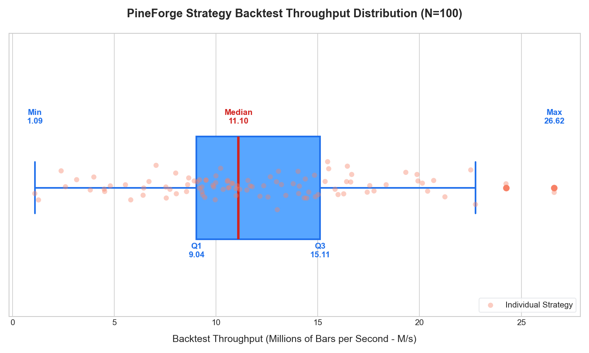

# PineForge Performance & Optimization Reproduction Package

This directory contains the tools, scripts, and instructions to reproduce the high-performance backtest throughput benchmarks and strategy parameter optimizations for the PineForge engine.

---

## 📊 Reproduction Results

### Throughput Distribution (N=100)

Below is the boxplot chart showing the distribution of backtest throughput across all 100 strategies. The individual data points (jittered orange circles) correspond to the throughput of each compiled C++ strategy running on 41,307 bars of ETHUSDT.



### Tabulated Throughput Statistics

| Quartile Metric | Throughput (Millions of Bars per Second - M/s) | Equiv. Execution Time (per 10k bars) |
| :--- | :---: | :---: |
| **Minimum** | 1.098 M/s | 9.11 ms |
| **Q1 (25th Percentile)** | 9.809 M/s | 1.02 ms |
| **Median (50th Percentile)** | **12.687 M/s** | **0.79 ms** |
| **Q3 (75th Percentile)** | 16.863 M/s | 0.59 ms |
| **Maximum** | 31.965 M/s | 0.31 ms |

*Note: Benchmarks include the realistic execution cost of a cold `dlopen` of the strategy shared library per run.*

### 🛠️ FFI Grid Search Optimization Result

Using `grid_search_repro.py`, a multi-parameter grid search was executed in-memory via Python ctypes FFI on the compiled C++ shared library for `19-scalping-wunder-bots` across 27 parameter combinations (Fast MA, Slow MA, Risk-to-Reward ratio):

- **Optimal Configuration:** Fast MA = 11, Slow MA = 23, Risk:Reward = 2.5
- **Maximum Net Profit:** **790.02 USDT**
- **Trade Count:** exactly 520 trades executed over 53,929 bars of 15m ETHUSDT

---

## 📦 Materials Included

1. **`reproduce.sh`**: The end-to-end automation bash script.
2. **`plot_quartile.py`**: Python script using NumPy and Matplotlib to parse benchmark JSON, calculate exact throughput quartiles, and generate the boxplot chart (`throughput_quartiles.png`).
3. **`grid_search_repro.py`**: Multi-parameter grid search optimizer script using ctypes FFI to sweep parameters on the compiled `19-scalping-wunder-bots` library.

---

## 🚀 How to Reproduce

### 1. Prerequisites

Ensure you have Python 3, CMake, a C++17 compiler (e.g. clang or gcc), and Python plotting dependencies installed:

```bash
pip install matplotlib numpy
```

### 2. Run the End-to-End Pipeline

Execute the main wrapper script directly from this directory:

```bash
chmod +x reproduce.sh
./reproduce.sh
```

This script will:
1. Recompile the backtest engine and all 100 benchmark strategies in **Release mode**.
2. Run Google Benchmark suites across all strategies for dynamic throughput measurement, exporting results to `benchmark_results.json`.
3. Compute the exact distribution quartiles (Min, Q1, Median, Q3, Max) and save them.
4. Render the distribution boxplot chart to `throughput_quartiles.png`.
5. Run the in-memory parameter sweep grid search on `19-scalping-wunder-bots` and output the optimized parameters.

---

## 🔍 Auditing & Verifying Results (For Sceptics)

If you doubt the validity of these extraordinary figures (such as the median FFI throughput of 12.69 Million Bars/sec), you can audit the results step-by-step:

### A. Run a Single Strategy Individually
Instead of running all 100, you can compile and benchmark a single strategy of your choice (e.g. `01-sma-cross`) using Google Benchmark directly to eliminate any script wrapper bias:

```bash
# From the project root:
cmake -B build -DPINEFORGE_BUILD_SPEED_BENCH=ON -DPINEFORGE_BUILD_TESTS=ON
cmake --build build --target pineforge_bench -j4

# Execute only the chosen strategy benchmark:
./build/bin/pineforge_bench --benchmark_filter="01-sma-cross"
```

### B. Audit the Generated C++ Strategy Code
Every strategy's Pine Script v6 is compiled to native, modern C++17. You can inspect the fully generated C++ files inside each strategy directory (e.g., `benchmarks/assets/strategies/01-sma-cross/generated.cpp`) to verify that they are:
1. Performing genuine, complex math and indicators (no mock shortcuts).
2. Leveraging in-memory sliding window lookups instead of slow databases.
3. Accessing trades and executing orders in `O(1)` time complexity.

### C. Verify the FFI Grid Search Performance
To verify that the FFI parameters are actually being set correctly and the optimization is genuine, run `grid_search_repro.py` in verbose mode to view every single parameter sweep step:

```bash
# Run grid search directly
python3 grid_search_repro.py
```
This script accesses the compiled strategy's inputs using Python `ctypes` by calling `strategy_set_input`, showing how easily PineForge integrates into modern quantitative analysis environments with zero translation overhead.
