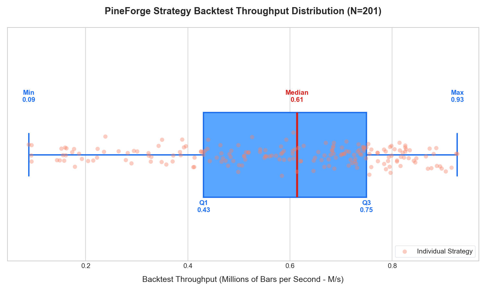

# PineForge Performance & Optimization Reproduction Package

This directory contains the tools, scripts, and instructions to reproduce the high-performance backtest throughput benchmarks and strategy parameter optimizations for the PineForge engine.

---

## 📊 Reproduction Results

### Throughput Distribution (N=201)

Below is the boxplot chart showing the distribution of backtest throughput across the 201 bench slots (the 100 public corpus probes and the maintainers' 101 closed scripts). The individual data points (jittered orange circles) correspond to the throughput of each compiled C++ strategy running on the 53,929-bar ETHUSDT 15m feed.



### Tabulated Throughput Statistics

| Quartile Metric | Throughput (Millions of Bars per Second - M/s) | Equiv. Execution Time (per 10k bars) |
| :--- | :---: | :---: |
| **Minimum** | 0.092 M/s | 109.15 ms |
| **Q1 (25th Percentile)** | 0.454 M/s | 22.04 ms |
| **Median (50th Percentile)** | **0.638 M/s** | **15.67 ms** |
| **Q3 (75th Percentile)** | 0.792 M/s | 12.62 ms |
| **Maximum** | 1.005 M/s | 9.95 ms |

*Note: the metric is GBench's `<slug>/throughput/no_magnifier` hot loop. Each strategy's shared library is `dlopen`ed once, outside the timed region. Each of the 20 timed iterations runs `strategy_create` plus `run_backtest` over the whole feed with the bar magnifier off, and the table reports the mean.*

*Last measured 2026-09-22 on an Apple M4 Max (16 cores) with engine `main` `063e4460`. This is the median of five quiet runs: the five run medians were 0.621, 0.638, 0.611, 0.646 and 0.640 M/s, and the table and chart come from the run with the median result (run 2). Every run started at a 1-minute load below 6 with no build or test process running; the loads are in [`../results/speed.md`](../results/speed.md). A public checkout only has the 100 public slots, whose median in the same run is 0.727 M/s. At engine `e9ad37dd` the same package measured 0.614 M/s.*

*The median fell from 17.05 M/s, measured 2026-05-29 on 100 strategies and a 41,307-bar feed. A same-host check against the engine of the 2026-06-11 speed table shows the current engine's per-bar cost is 10–18× higher on the probes both populations share (see [`../results/speed.md`](../results/speed.md), Provenance).*

### 🛠️ FFI Grid Search Optimization Result

`grid_search_repro.py` runs a multi-parameter grid search in memory, through Python ctypes FFI, on the compiled C++ shared library for `021-composite-scalping-integration-01`: an EMA-cross scalper with take-profit and stop-loss exits in ticks, and the public analogue of the retired `19-scalping-wunder-bots`. The sweep covers 27 combinations: Fast EMA 3/5/7 × Slow EMA 11/13/15 × take profit 10/15/20 ticks, with the stop loss held at its default of 7 ticks.

- **Best configuration:** Fast EMA = 3, Slow EMA = 15, take profit = 20 ticks
- **Net profit:** **−103.16 USDT**. The probe is a mechanism test, not a profitable strategy: every combination loses. The sweep demonstrates the FFI loop, not an edge.
- **Trade count:** 5,153 trades over 53,929 bars of 15m ETHUSDT

---

## 📦 Materials Included

1. **`reproduce.sh`**: The end-to-end automation bash script.
2. **`plot_quartile.py`**: Python script using NumPy and Matplotlib to parse benchmark JSON, calculate exact throughput quartiles, and generate the boxplot chart (`throughput_quartiles.png`).
3. **`grid_search_repro.py`**: Multi-parameter grid search optimizer script using ctypes FFI to sweep parameters on the compiled `021-composite-scalping-integration-01` library.

---

## 🚀 How to Reproduce

### 1. Prerequisites

Ensure you have Python 3, CMake, a C++17 compiler (e.g. clang or gcc), and Python plotting dependencies installed:

```bash
pip install matplotlib numpy
```

### 2. Run the End-to-End Pipeline

Execute the main wrapper script directly from this directory:

```bash
chmod +x reproduce.sh
./reproduce.sh
```

This script will:
1. Recompile the backtest engine and every bench strategy in **Release mode**: the 100 public slots, plus the 101 closed slots when the maintainers' `benchmarks/assets-closed/` root is present.
2. Run Google Benchmark suites across all strategies for dynamic throughput measurement, exporting results to `benchmark_results.json`.
3. Compute the exact distribution quartiles (Min, Q1, Median, Q3, Max) and save them.
4. Render the distribution boxplot chart to `throughput_quartiles.png`.
5. Run the in-memory parameter sweep grid search on `021-composite-scalping-integration-01` and output the optimized parameters.

---

## 🔍 Auditing & Verifying Results (For Sceptics)

You can audit these figures (such as the median hot-loop throughput of 0.64 million bars per second) step by step:

### A. Run a Single Strategy Individually
Instead of running every slot, you can compile and benchmark a single strategy of your choice (e.g. `001-analyzer-anvil-percent-costs-01`) using Google Benchmark directly to eliminate any script wrapper bias:

```bash
# From the project root:
cmake -B build -DPINEFORGE_BUILD_SPEED_BENCH=ON -DPINEFORGE_BUILD_TESTS=ON
cmake --build build --target pineforge_bench -j4

# Execute only the chosen strategy benchmark:
./build/bin/pineforge_bench --benchmark_filter="001-analyzer-anvil-percent-costs-01"
```

### B. Audit the Generated C++ Strategy Code
Every strategy's Pine Script v6 is compiled to native, modern C++17. You can inspect the fully generated C++ files inside each strategy directory (e.g., `benchmarks/assets/strategies/001-analyzer-anvil-percent-costs-01/generated.cpp`) to verify that they are:
1. Performing genuine, complex math and indicators (no mock shortcuts).
2. Leveraging in-memory sliding window lookups instead of slow databases.
3. Accessing trades and executing orders in `O(1)` time complexity.

### C. Verify the FFI Grid Search Performance
To verify that the FFI parameters are actually being set correctly and the optimization is genuine, run `grid_search_repro.py` in verbose mode to view every single parameter sweep step:

```bash
# Run grid search directly
python3 grid_search_repro.py
```
This script accesses the compiled strategy's inputs using Python `ctypes` by calling `strategy_set_input`, showing how easily PineForge integrates into modern quantitative analysis environments with zero translation overhead.
